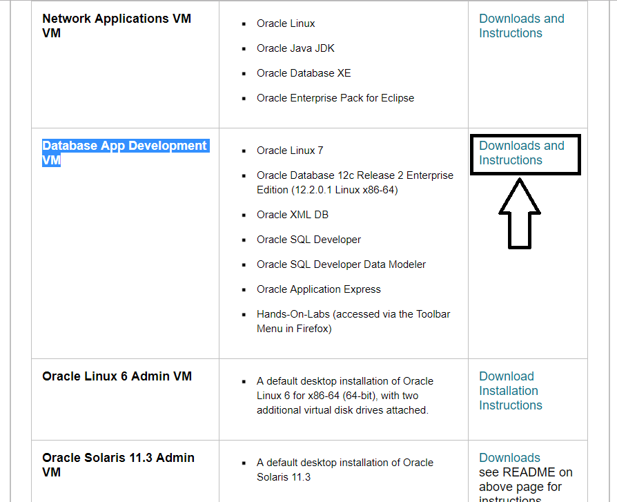

# OracleSQLDeveloper
How to setup Oracle SQL Developer and perform Assignment 2.

We will use a Demo Oracle Database Virtual Machine running Oracle 12c to complete Assignment 2.

Go to the following site:

<a href="https://goo.gl/zTQSxm">Virtual Machine Download </a>

We will download the App Development VM as shown in the figure below.  Click on Downlaods and Instructions.



On the page that comes up, go down the page to <b> Setup</b> and Accept License Agreement.  You can download the vitural machine.
If you do not have an account, you can create a free Oracle account.


Once the VM downaloads (can take quite a bit of time depending on your connection speed), opne Virtualbox and click on File --> Import Appliances and navigate to where you saved your file.


Once you have loaded your OVA file, you can then start the machine as you would a normal VM machine.

In the terminal that open, start SQL Developer by typing

> sqldeveloper

In the application that opens up, we will create a new connection by clicking the green botton on the left pane as shown below.


In the new connection window that opens up, fill in the information as follows.  The password (for this and all other cases in the VM environment) is "oracle".  Once you are done, click "Test".  You should see the words Status:Success appear as shown in the Figure.  If you get an error message, make sure all the fields are correctly typed and try again.


Now Select connect.

Download the file createStudent.sql and sql_book_add_tables.sql from the course website.

In SQL Developer Click File Open.

Click the Browse button and locate the script createStudent.sql that you just downloaded.

Open the file, which brings it into the worksheet.

Click the Run Script icon or F5 to run the script.

After the script completes (approximately 3-5 minutes), it will show a list of counts representing the number of rows it created for each table. Compare that list on screen with the following list. The two lists should match.
```
Count of COURSE Table: 30
Count of ENROLLMENT Table: 226
Count of GRADE Table: 2004
Count of GRADE_CONVERSION Table: 15
Count of GRADE_TYPE Table: 6
Count of GRADE_TYPE_WEIGHT Table: 300
Count of INSTRUCTOR Table: 10
Count of SECTION Table: 78
Count of STUDENT Table: 268
Count of ZIPCODE Table: 227
```
Click the Browse button to locate in the C:\guest\schemasetup directory the script named sql_book_add_tables.sql
Open the file, which brings it into the worksheet.

Click the Run Script icon or F5 to run the script.

Select your apollo_oracle connection tab.

Type SELECT * FROM COURSE

Click the Run Script icon or F5 to run the script.  Make sure you get a list of courses.
